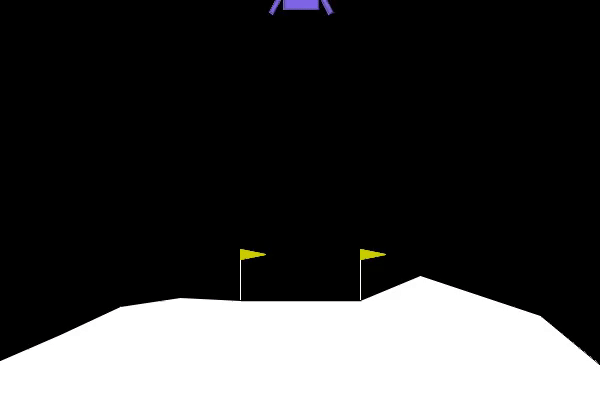
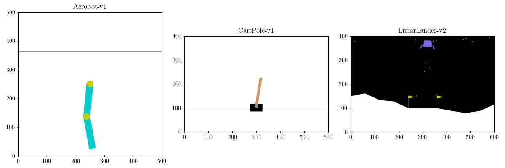

# Investigating the benefits of adding self-attention to a Deep Q-Network

 <div align="center">
     
    <p>
        <strong>Fig.</strong> 1. An example of a successfully trained TQN.
    </p>
</div> 

## Abstract

In recent years, the Transformer architecture has revolutionized how we process
sequential data, but its applications in online RL settings are still very
limited. In this paper a Transformer architecture is applied as the first layer
inside a DQN in order to process in a set of observations. The hypothesis is
that the encoder-decoder architecture can extract more information from an
observation than a linear layer. Furthermore, the multi-head attention can help
the network focus on what experiences are deemed most important. In the end I
provide detailed results, backed by a recently suggested statistical framework,
to show that the proposed architecture surpasses the baseline on 1 of the 3
classic control environments used for evaluation, but on average it performs
worse, providing a good starting point for future research.

## Available Environments

 <div align="center">
     
    <p>
        <strong>Fig.</strong> 2. Example screenshots for each environment. From
            left to right: Acrobot, CartPole, LunarLander.
    </p>
</div>


The `train` and `play` modules support any environment that has a
[`Box`](https://gymnasium.farama.org/api/spaces/fundamental/#box) observation
space and a
[`Discrete`](https://gymnasium.farama.org/api/spaces/fundamental/#discrete)
action space.

Plotting utils use hardcoded values for x-axis and y-axis ticks and limits
for `Acrobot-v1`, `CartPole-v1` and `LunarLander-v2`, but additional
environments can be accomodated with minimal modifications.

## Installation

Python 3.11 is required.

```shell
git clone git@github.com:robertoschiavone/transformer-q-network.git
cd transformer-q-network
pip install -r requirements.txt
```

## Usage

If your machine supports CUDA, it is necessary to export the
`CUBLAS_WORKSPACE_CONFIG` environment variable.

```shell
export CUBLAS_WORKSPACE_CONFIG=:4096:8
```

### Train

```shell
python -m tqn --train --env-id $ENV_ID
```

Optional arguments:

- `--seed`: an integer number. If no seed is passed, the model will
  still be trained deterministically by using the current Unix timestamp,
  approximated to the closest second, as a seed.

- `--network`: either `DQN` or `TQN`. Default is `TQN`.

You can find previously trained models and their TensorBoard training
respectively inside the folders `models` and `logs`.

### Play

```shell
python -m tqn --play --env-id $ENV_ID --model $MODEL_NAME
python -m tqn --play --env-id LunarLander-v2 \
  --model ./models/LunarLander-v2/DQN/1693526400.zip # example
```

Optional arguments:

- `--seed`: as above.

### Plot

```shell
python -m tqn --plot --env-id $ENV_ID --plot-type $PLOT_TYPE
```

`$PLOT_TYPE` has to be one of the following values:

- `environments` ([example](./plots/environments.pdf))

- `q-vs-frame` ([example](./plots/q-vs-frame_DQN_LunarLander-v2.pdf))

- `q-vs-loss` ([example](./plots/q-vs-loss_DQN-TQN_LunarLander-v2.pdf))

- `q-vs-reward`([example](./plots/q-vs-reward_LunarLander-v2.pdf), it works only
  for LunarLander-v2)

- `sample-efficiency-probability-improvement` ([example](./plots/sample-efficiency-probability-improvement_DQN-TQN_LunarLander-v2.pdf))

- `score-vs-episode` ([example](./plots/score-vs-episode_DQN-TQN_LunarLander-v2.pdf))

- `statistics` ([example](./plots/statistics_DQN-TQN_LunarLander-v2.pdf))

You can see further examples inside the folder `plots`.

### TensorBoard

```shell
python -m tensorboard.main --load_fast true --logdir "./logs"
```

## Folder Structure

```text
.
├── config
│   └── {ENVIRONMENT}.json
├── logs
│   └── {ENVIRONMENT}
│       └── {NETWORK}
│           └── {SEED}
│               └── events.out.tfevents.{TIMESTAMP}.archlinux.0.0
├── models
│   └── {ENVIRONMENT}
│       └── {NETWORK}
│           └── {SEED}.zip
├── plots
│   └── {PLOT}.pdf
├── thesis
│   └── {LATEX FILES}
├── tqn
│   └── {SOURCE CODE}
├── LICENSE
├── LunarLander-v2_TQN_1694390400.gif
├── README.md
├── requirements.txt
└── thesis.pdf
```

## Related Work

- [CleanRL](https://github.com/vwxyzjn/cleanrl), Clean Implementation of RL
  Algorithms

- [Rainbow is all you need!](https://github.com/Curt-Park/rainbow-is-all-you-need)

- [Stable-Baselines3](https://stable-baselines3.readthedocs.io/en/master/),
  Reliable Reinforcement Learning Implementations
